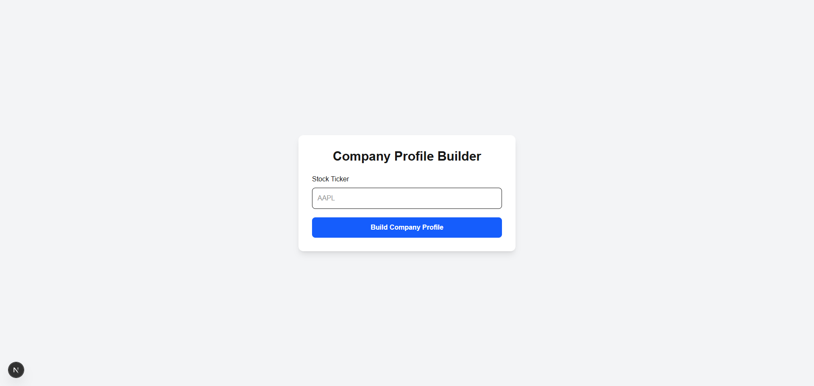
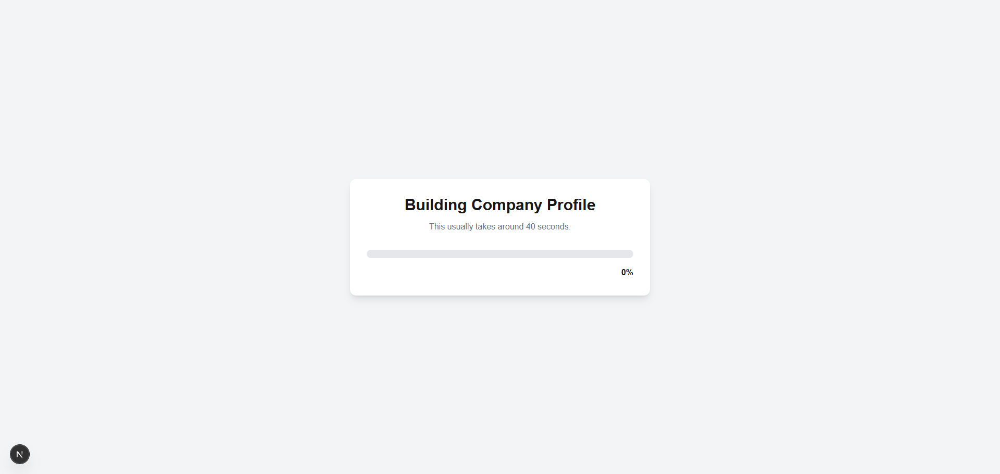
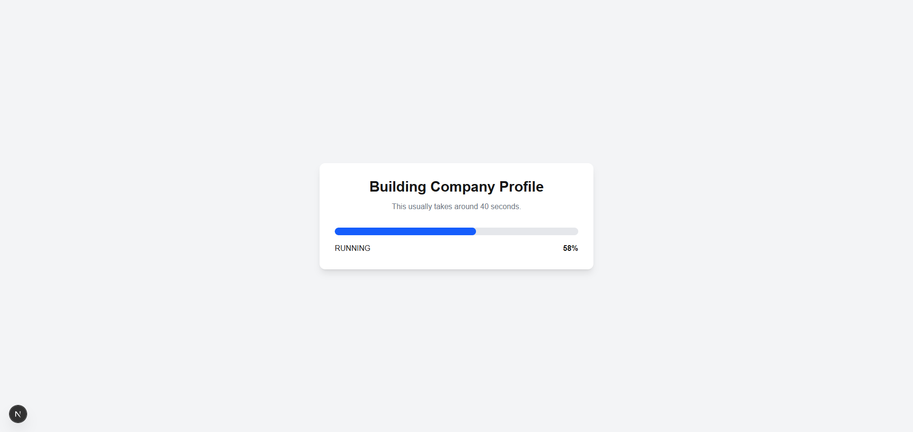
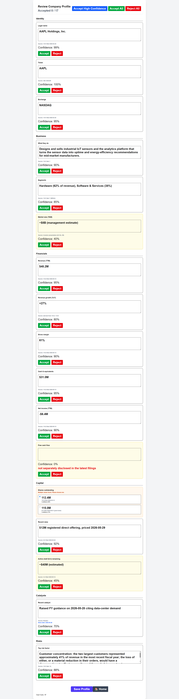

# Company Profile Builder

## Overview

This project is a full-stack implementation of a company profile builder using **Next.js**, **FastAPI**, and **SQLite**. The application integrates with the provided Profile Builder Stub, which simulates a long-running background service that generates company profile data from a stock ticker.

The focus of this project was not on collecting SEC or news data, but on building the product layer around it—handling asynchronous jobs, presenting generated data for review, and allowing users to save an approved profile.

---

# Architecture

```
Frontend (Next.js)
        │
        ▼
Backend (FastAPI)
        │
        ▼
Profile Builder Stub
        │
        ▼
SQLite Database
```

The backend acts as a bridge between the frontend and the provided stub service. It hides the implementation details of the stub and exposes a simple API for the frontend while also managing persistence.

---

# Tech Stack

### Frontend

- Next.js (App Router)
- React
- TypeScript
- Tailwind CSS
- Axios

### Backend

- FastAPI
- SQLAlchemy
- SQLite
- Pydantic

---

# Async Build Process

The profile generation process intentionally takes around 40 seconds to complete. Since this is a long-running operation, I wanted to make sure the interface remained responsive instead of leaving the user on a loading screen.

After a user submits a ticker:

1. The frontend sends the ticker to the backend.
2. The backend starts a build using the provided stub service.
3. The stub returns a Job ID immediately.
4. The frontend polls the backend every few seconds for updated progress.
5. Polling stops automatically when the build either completes or fails.

I chose polling because it matches the API exposed by the stub service and keeps the implementation straightforward. If the real service supported WebSockets or Server-Sent Events, I would likely switch to one of those approaches.

---

# Review Experience

Once the profile has been generated, the application presents every field individually instead of automatically accepting generated data.

Each field displays:

- Label
- Current value
- Source
- Confidence score

Users can:

- Edit generated values
- Accept individual fields
- Reject individual fields
- Perform bulk actions where appropriate

The goal was to make it easy to review generated information instead of assuming every value is correct.

---

# Handling Different Field Types

The provided stub returns several different field types, and the UI handles each one separately.

### Normal Fields

Displayed with their value, source, and confidence score.

### Low Confidence

Fields with confidence below 0.6 are highlighted so they are easier to review before being accepted.

### Missing Values

Missing values are clearly indicated along with the note returned by the service.

### Conflicting Values

When multiple candidate values are returned, the interface allows the user to choose which value should be accepted.

### News-Sourced Fields

News-based fields display their publication date in addition to the normal source information.

---

# State Management

The application keeps the user informed throughout the build process by displaying:

- Progress updates
- Loading states
- Error messages
- Completed status

Once a profile has been reviewed, it can be saved and later retrieved from the database.

---

# Persistence

Accepted profiles are stored in SQLite through the FastAPI backend.

The backend stores:

- Job ID
- Company ticker
- Current status
- Progress
- Generated profile JSON

This allows previously saved profiles to be loaded again without rebuilding them.

---

# Error Handling

Several error scenarios are handled gracefully.

### Empty Ticker

The backend validates the request and returns an error if the ticker is missing.

### Unknown Job ID

Invalid job IDs return a proper error response instead of causing an application crash.

### Build Failure

The provided `FAILCO` ticker simulates an upstream failure.

When this occurs:

- Progress stops
- The user is shown a meaningful error message
- The user can retry the build

One limitation of the provided stub is that it does not return partial profile data before failing. Because of that, there are no accepted fields available to preserve during the failed build. If partial responses were available, preserving reviewed fields across retries would be straightforward.

---

# API Design

The frontend communicates only with the FastAPI backend.

Available endpoints include:

| Method | Endpoint | Purpose |
|---------|----------|----------|
| POST | `/api/build` | Start a new profile build |
| GET | `/api/profile/{job_id}` | Get build progress |
| POST | `/api/profile/save/{job_id}` | Save reviewed profile |
| GET | `/api/profile/saved/{job_id}` | Load saved profile |

Keeping the frontend independent of the stub service makes it easier to replace the stub with a real implementation later.

---

# Project Structure

```
company-profile-builder/

├── frontend/
│   ├── app/
│   ├── components/
│   ├── services/
│   └── types/
│
├── backend/
│   ├── app/
│   │   ├── api/
│   │   ├── services/
│   │   ├── repositories/
│   │   ├── models/
│   │   ├── schemas/
│   │   └── database/
│   │
│   └── storage/
│
└── stub/
```

---

# Running the Project

### Start the Stub

```bash
cd stub
uvicorn profile_builder_stub:app --reload --port 9000
```

### Start the Backend

```bash
cd backend
uvicorn app.main:app --reload
```

### Start the Frontend

```bash
cd frontend
npm install
npm run dev
```

---

### Screenshots

## Home Page



## Search ticker - Start progress



## Progress bar



## Result - Company profile



## Failco

